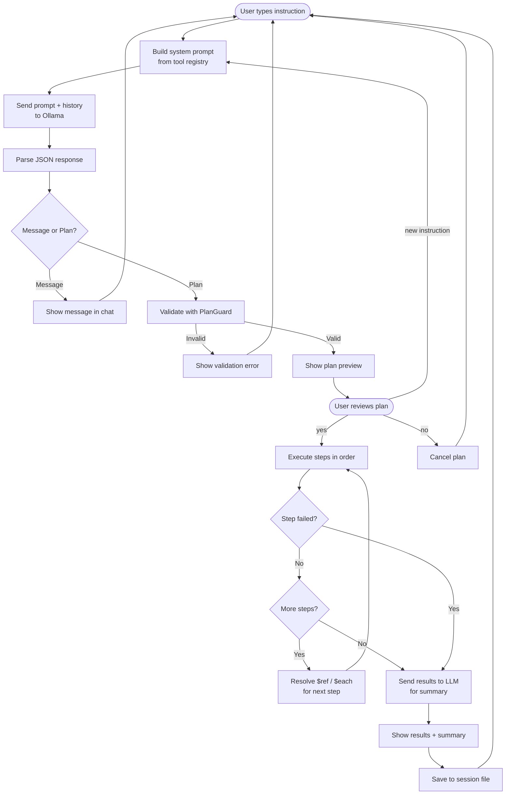
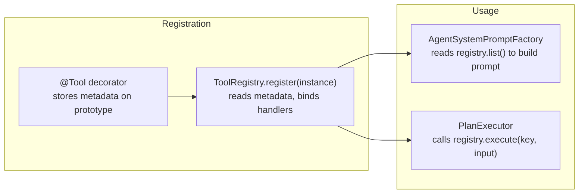

# WATI Agent

## How to Run

### Requirements

- [Bun](https://bun.sh/)
- [Ollama](https://ollama.com/) running locally with a model capable of structured JSON output

### Install

```bash
bun install
```

### Demonstration

https://github.com/user-attachments/assets/2d5e3ad5-cdcf-4c7d-85bc-ddd0a3a2baae


### Start

```bash
OLLAMA_MODEL=gemma4:e4b bun run dev
```

You can also enable or disable the Ollama "think" mode (which shows intermediate reasoning steps) with the `OLLAMA_THINK` environment variable:

```bash
OLLAMA_MODEL=gemma4:e4b OLLAMA_THINK=true bun run dev
```

### Terminal commands

| Input                                 | Effect                                  |
| ------------------------------------- | --------------------------------------- |
| Any text + Enter                      | Send instruction to the agent           |
| `yes` / `sim`                         | Execute the previewed plan              |
| `no` / `nao`                          | Cancel the previewed plan               |
| New instruction while plan is pending | Replace the current plan with a new one |
| `/resume`                             | List saved sessions                     |
| `/resume <uuid>`                      | Reopen a saved session                  |
| `Esc` (while thinking)                | Cancel the current request              |
| `/quit`                               | Exit                                    |

## Problem Framing

I treated this challenge as a mini product design exercise, where the "product" is an agent that can understand user instructions, plan a sequence of API calls using a defined toolset, and execute them with user confirmation. The core question is: given a user request like "Move 6289876543210 to Sales and add the follow_up tag", how does the system produce a reviewable sequence of API calls?

That led to four constraints that shaped the whole implementation:

1. The model should only plan with tools that actually exist in the codebase without manual prompt editing when tools are added or changed.
2. The user must see the proposed calls before anything mutating happens.
3. The implementation should be small enough to finish the challenge quickly but complete enough to demonstrate the core concepts of orchestration, planning, and execution.
4. The mock backend should be realistic enough to demonstrate orchestration across multiple related API calls, but simple enough to implement without spending time on HTTP, authentication, or error handling.
5. The core logic should be decoupled from the UI, so that the same planning and execution could be reused in a different interface (e.g. web server) if desired.

Based on that, I scoped the MVP around the full endpoint subset listed in the assignment brief, but kept the runtime simple: all actions are planned first, reviewed by the user, and then executed against a deterministic mock backend.

## Architecture

The project follows a ports-and-adapters structure with three layers:

```
src/
  domain/           # Types and port interfaces (no dependencies)
    agent.ts        # Plan, ToolCall, AgentResponse types
    session.ts      # Session turn types
    ports/
      wati-gateway.ts    # Contract for WATI API operations
      llm-provider.ts    # Contract for LLM interaction
      tool-catalog.ts    # Contract for tool registry (ToolExecutor, ToolDefinition)
      session-store.ts   # Contract for session persistence

  app/              # Use cases and application logic
    agent-system-prompt.ts   # Builds the system prompt from registered tools
    plan-parser.ts           # Parses model JSON output into message or plan
    plan-executor.ts         # Executes plan steps, resolves $ref and $each references
    run-agent-use-case.ts    # Orchestrates prompt -> model -> parse -> validate -> execute
    session-history.ts       # Converts session turns to LLM history format
    guardrails/
      plan-guard.ts          # Validates tool names, step IDs, forEach syntax

  infra/            # Concrete implementations
    llm/
      ollama-provider.ts       # Streaming Ollama client with timeout and cancellation
    tools/
      tool.decorator.ts        # @Tool decorator for metadata registration
      tool-registry.ts         # Collects decorated methods, exposes them as ToolExecutor
    wati/
      wati-tools.ts            # Tool methods exposed to the agent (decorated)
      mock-wati-gateway.ts     # In-memory mock with seed data
    session/
      file-session-store.ts    # JSON file persistence in .sessions/
    ink/
      terminal-app/            # Chat UI components
      terminal-app-service.ts  # Session operations used by the UI
```

## Execution Flow



1. The user types an instruction. The system prompt is built dynamically from the tool registry and sent to Ollama along with the session history.
2. The model returns JSON. `PlanParser` classifies it as a conversational message or a structured plan.
3. If it's a plan, `PlanGuard` validates tool names, step IDs, and `forEach` syntax. Invalid plans are rejected before the user sees them.
4. The plan preview is rendered in the chat. Nothing is executed yet.
5. If the user confirms, `PlanExecutor` runs each step in order, resolving `$ref:` and `$each:` references between steps.
6. After execution (or on the first failure), the results go back to the LLM for a conversational summary.
7. Everything is persisted to `.sessions/<uuid>.json`.

## Tool Catalog Design

One of the first decisions was how to expose tools to the agent without hardcoding them in the system prompt. The solution uses TypeScript decorators and a registry:



Each tool method in `WatiTools` is annotated with `@Tool(key, description, parameters)`. At bootstrap, `ToolRegistry.register(new WatiTools(gateway))` reads the decorator metadata from the prototype and indexes each method by its own key. Then, the prompt iterates over `registry.list()` to generate the tool documentation section of the system prompt dynamically.

This means adding a new tool is a single decorated method and no prompt editing and manual registration is needed. It also ensures that the model can only plan with tools that actually exist in the codebase, since the prompt is generated from the registry.

### Available tools

| Key                              | Description                                       |
| -------------------------------- | ------------------------------------------------- |
| `wati.list_contacts`             | List contacts with optional tag/attribute filters |
| `wati.get_contact_info`          | Get details for a single contact                  |
| `wati.add_contact`               | Create a new contact                              |
| `wati.update_contact_attributes` | Update custom attributes                          |
| `wati.add_tag`                   | Add a tag to a contact                            |
| `wati.remove_tag`                | Remove a tag from a contact                       |
| `wati.send_session_message`      | Send a plain text message                         |
| `wati.send_template_message`     | Send a template message with parameters           |
| `wati.list_message_templates`    | List available templates                          |
| `wati.send_broadcast_to_segment` | Send a broadcast to a segment                     |
| `wati.assign_team`               | Assign a conversation to a team                   |
| `wati.assign_operator`           | Assign a conversation to an operator              |
| `wati.list_operators`            | List available operators                          |

### Multi-step plans and references

The agent can compose multiple tools in a single plan. When a step depends on a previous result, it uses reference syntax:

- `$ref:step_1.fieldName` resolve a single value from a prior step's result.
- `$each:step_1` with `$item.fieldName` iterate over an array result and run the tool once per item.

Example: "Find contacts where plan is premium and send them the welcome_message template" produces:

```
step_1: wati.list_contacts (attributeName=plan, attributeValue=premium)
step_2: wati.send_template_message (forEach=$each:step_1, whatsappNumber=$item.whatsappNumber, ...)
```

## Guardrails

`PlanGuard` runs before every plan preview and before execution. It checks:

- Every tool name in the plan matches a registered tool.
- Step IDs are unique (no duplicates).
- `forEach` values follow the `$each:<stepId>` syntax.
- The plan has at least one step and a non-empty objective.

If validation fails, the plan is rejected before the user ever sees it, and the error is shown in the chat.

## System Prompt Design

The system prompt is generated at runtime from the tool registry, not written as a static string. This gives the model three constraints:

- It only sees tools that actually exist.
- It sees each parameter's name, type, and whether it's required or optional.
- It must respond in exactly one of two JSON formats: a conversational message or a plan preview.

The prompt also includes rules to reduce common failure modes observed during development:

- Optional parameters may be omitted. The model was previously treating them as mandatory.
- Natural-language filters should be converted directly into tool parameters instead of asking the user to restate them.
- Plans are previews only. The model should never claim something has already been executed.

## LLM Usage

The project uses a local Ollama model for two tasks:

1. **Plan generation**: understanding the user's instruction, deciding if clarification is needed, choosing tools, and producing a structured plan.
2. **Result interpretation**: after execution, the model receives the tool results and generates a conversational summary.

The model is not responsible for execution, tool validation, or reference resolution. Those stay in application code, where they can be checked deterministically.

This split exists because the model is good at turning natural language into intent and at summarizing structured data for a human reader. The code is better at enforcing structure, controlling execution order, and making sure only registered tools are called.

## Session Persistence

Each chat is stored as a JSON file in `.sessions/<uuid>.json`. The file contains every turn in the conversation: user instructions, agent responses, plan previews, execution results, cancellations, and post-execution summaries.

This serves two purposes:

- **Conversational memory**: the full history is sent to the LLM on each request, so the agent has context from earlier in the session.
- **Session resume**: `/resume <uuid>` reloads a previous session and continues from where it left off.

## Example Requests

```
Create a contact for 6287000001111 named Maya and set city to Bandung
```

```
Move 6289876543210 to Sales and add the follow_up tag
```

```
Show me the available message templates
```

```
Find contacts where plan is premium and send them the welcome_message template
```

```
Assign 6281234567890 to agent@company.com
```

```
Send a broadcast named april_campaign to the retained_users segment using order_confirmation
```

## Build Notes

### Development sequence

1. Started by defining the port interfaces: `WatiGateway` for the WATI API surface and `LlmProvider` for the model interaction. This established what tools the agent would have access to before writing any implementation.
2. Built the `ToolExecutor` contract and the system prompt factory, focusing on how to describe the agent's capabilities and response format to the LLM.
3. Designed the decorator and registry system (`@Tool` + `ToolRegistry`) so that tools could be added as annotated methods without touching the prompt template.
4. Implemented the plan parser, guard, and executor to handle the full lifecycle: parse model output, validate it, preview it, and execute it on confirmation.
5. Built the terminal UI with Ink. Chose Ink over a web server because it keeps the demo self-contained and avoids the overhead of HTTP/WebSocket infrastructure for what is fundamentally a conversation loop.
6. The biggest challenge was getting the system prompt right. The model needed enough structure to produce valid plans consistently, but not so much that it became rigid or started asking unnecessary questions. The final prompt went through several iterations to handle edge cases like optional parameters and natural-language filters.

### What I prioritized

- A visible preview-before-execution loop.
- Plan composition across the full route subset from the brief.
- Clear separation between planning, validation, execution, and persistence.
- A mock backend that makes the demo stable and repeatable.
- A conversational terminal UI instead of a command-driven CLI.

### What I intentionally did not build

- Real WATI HTTP adapter (the mock gateway implements the same interface and is swappable).
- Retry logic, rate-limit handling, or rollback.
- Authentication and secrets management.
- Automated test coverage.

### Time allocation (approximate)

I spent about 7-8 hours on this project, distributed roughly as follows:

| Area                                      | Share |
| ----------------------------------------- | ----- |
| Planning and tool schema design           | ~25%  |
| Execution model and step references       | ~20%  |
| Terminal conversation flow and preview UX | ~25%  |
| Session persistence and resume            | ~10%  |
| Mock data and tool implementation         | ~5%   |
| Documentation and cleanup                 | ~15%  |

## Trade-offs

### Mock backend instead of real API calls

The mock gateway (`MockWatiGateway`) implements the same `WatiGateway` interface that a real HTTP adapter would. It uses in-memory seed data and returns deterministic results.

This makes the demo repeatable and avoids spending time on HTTP integration, but it means the repository doesn't demonstrate real authentication, pagination, or WATI response edge cases. Swapping to a real adapter means implementing the same interface with `fetch` calls.

### Model plans, code executes

The LLM chooses which tools to call and in what order. The application code validates the plan, resolves references, and runs the actual calls. The model never executes anything directly.

This keeps planning flexible while maintaining control over what can actually happen. The trade-off is that the agent is limited to the expressiveness of the registered tool set and it can't improvise beyond what's registered.

### Local LLM via Ollama

Using Ollama keeps the demo free of external API keys and network dependencies. The downside is that output quality depends on the local model and hardware. If the model produces invalid JSON, the parser falls back to treating the raw output as a plain message.

## Error Handling

The project covers the main failure scenarios that can occur during planning and execution:

| Scenario                                 | Handling                                                                                                                                                                                     |
| ---------------------------------------- | -------------------------------------------------------------------------------------------------------------------------------------------------------------------------------------------- |
| Missing required parameter               | The system prompt instructs the model to ask the user instead of guessing. `WatiTools.requireString` also validates at execution time and throws a descriptive error if the field is absent. |
| Unknown tool in a plan                   | `PlanGuard.ensureKnownTool` rejects the plan before it reaches the user.                                                                                                                     |
| Duplicate step IDs                       | `PlanGuard.validate` rejects the plan.                                                                                                                                                       |
| Invalid `forEach` syntax                 | `PlanGuard.validate` rejects the plan.                                                                                                                                                       |
| Invalid JSON from the model              | `PlanParser` falls back to treating the raw output as a conversational message instead of crashing.                                                                                          |
| Contact, template, or operator not found | `MockWatiGateway` throws an error with a message describing what was missing (e.g. `Contact 628... not found`).                                                                              |
| Failure mid-execution                    | `PlanExecutor` stops at the first failing step and preserves partial results so the user can see what succeeded and what failed.                                                             |
| Model timeout                            | `OllamaProvider` uses an `AbortController` with a configurable timeout (`timeoutMs`).                                                                                                        |
| User cancellation                        | Pressing `Esc` during a request aborts it via `AbortSignal`, and the UI returns to idle state.                                                                                               |

### What is not handled

- **Automatic retry**: if a tool call fails, the agent does not retry it. The user sees the error and can issue a new instruction.
- **Rollback**: if step 3 of 5 fails, steps 1 and 2 are not undone. Partial results are preserved but not compensated.
- **Rate limiting and pagination**: the mock backend returns all results at once. A real adapter would need to handle paginated responses and API rate limits.

## Current Limitations

- No real WATI HTTP integration (the mock gateway is swappable via the `WatiGateway` interface).
- The markdown renderer in the terminal only supports the subset of markdown used by this app (headings, lists, code blocks, inline code, bold, italic).
- Output quality depends on the local Ollama model and hardware.

## V2 Roadmap

1. Implement a real `WatiGateway` adapter with HTTP calls behind the existing interface.
2. Add automated tests for plan parsing, plan execution, guard validation, and session resume.
3. Add progress reporting for large `$each` loops (rate limits, partial results).
4. Add rollback support: if step 3 of 5 fails, undo steps 1 and 2 where possible.
5. Expand the tool surface only after those foundations are in place.
